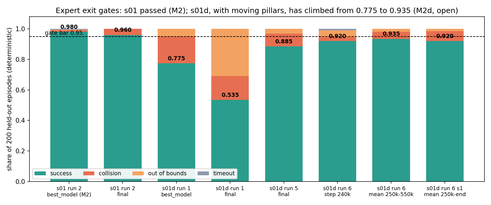
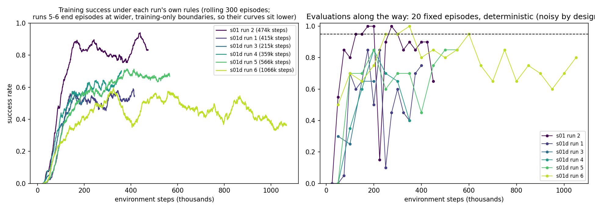
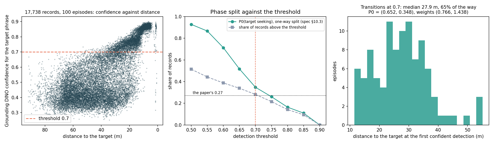
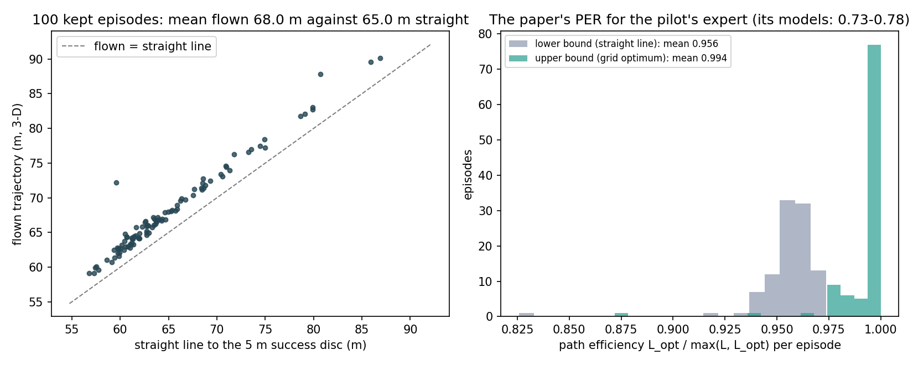
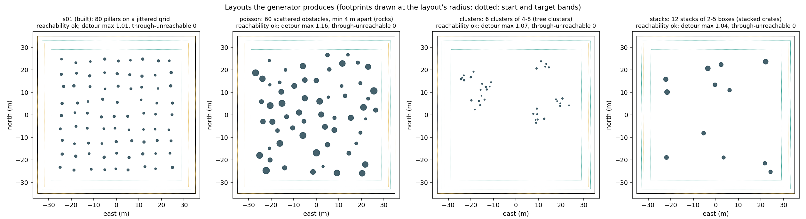

# autofly_ue5: project status, 2026-10-07

What this project has built and measured so far, in one folder: the simulation side of AutoFly (arXiv 2602.09657)
recreated on Unreal Engine 5.7.4 + Project AirSim 1.0.1, SAC "expert" pilots that fly procedurally built obstacle
scenes, and the AutoFly-format dataset their flights become. Every number below is read from a record in `records/`
(copies of `docs/gates/*.json` and the dataset's own files) by `scripts/results_figures.py`; the videos are the
project's own renders (`scripts/render_episodes.py`, `scripts/dataset_episode_video.py`). Code state: `main` at
e44a859.

## Milestones

| # | Milestone | State | Evidence |
|---|---|---|---|
| M0 | UE5 + Project AirSim installed, smoke test | **Passed** 2026-09-15 | `m0_gate.json` |
| M1 | `sim/` module; scene s01 built from JSON and packaged | **Passed** 2026-09-16 | `m1_gate.json` |
| M2 | SAC expert on s01 (white pillars) ≥ 0.95 over 200 episodes | **Passed** 2026-09-26: 0.98 deterministic, 0.99 stochastic | `records/m2_gate.json` |
| M2d | moving pillars (s01d): expert ≥ 0.95 | **Open**: 0.775 → 0.885 → 0.920 → **0.935** over six runs; the bar is 0.95 | `records/m2d_*_gate.json` |
| M3 | collector, dataset writer, validator; 100-episode pilot | **Passed** 2026-10-03: 100 of 101 episodes kept, 17,738 records, TFDS reads them back exactly | `records/m3_gate.json` |
| M5 (part) | dataset rebalancing (paper App. A.2.4) | **Done on the pilot** 2026-10-07 | `records/s01_pilot_rebalance.json` |
| M4 | asset library; scenes s02–s12 | **Started**: every placement type generates and is checked offline; editor work next | `docs/superpowers/plans/…plan5…` |
| M6 (part) | path efficiency (the paper's PER) | **Measured on the pilot** | `records/s01_pilot_path_efficiency.json` |

## 1. The experts and their gates

Each bar is one trained expert flown deterministically on the same 200 held-out episodes (seeds the training never
saw). s01's expert passed at 0.98. On s01d, where 8–12 of the 80 pillars move along random routes and yield to the
drone, six runs took the success rate from 0.775 to 0.935; the remaining failures are near misses at full speed past
a mover that has stopped to yield (`docs/decisions/2026-10-06-s01d-r6-plan.md`). What moved the number, run by run:

| Run | Change | Gate |
|---|---|---|
| 1 | depth-only expert, 3 stacked depth frames | 0.775 (best_model); final learned to dive out of the altitude band (0.535) |
| 2 | warm start from run 1 with a fresh buffer | collapsed within 15k updates (never warm-start SAC without its buffer) |
| 3 | from scratch, privileged mover input, out-of-bounds priced like a collision | 0.65 on 20 episodes at 200k; paused |
| 4 | run 3 + per-step mover clearance penalty | 0.78 in selection; did not move the contact distances |
| 5 | run 4 + a 0.3 m training contact margin and an altitude margin | **0.885**; mover collisions 35 → 7 |
| 6 | run 5 + a 1.1 m static boundary, a 0.5 m mover margin, a V-shaped altitude cost | **0.920**; static collisions 10 → 0; the **mean of 31 checkpoints 0.935** |
| 6, session 1 | 500k more steps; the 250k–end mean | 0.920, and 186/200 on a fresh confirmation set (0.925 over both) |

Left: training success under each run's own rules (runs 5–6 end episodes at wider training-only boundaries, which is
why they sit lower while gating higher). Right: the 20-episode deterministic evaluations made along the way, noisy by
design; checkpoints are chosen on 40- and 100-episode validation stages, never on these.

Videos (`videos/`): `s01_m2_best_model_ep027_success.mp4` (a clean crossing of the pillar field),
`s01_m2_best_model_ep175_collision.mp4` (one of its four collisions), `s01d_run1_best_model_ep037_collision.mp4`
(run 1 hit by a mover from out of view), `s01d_run6_mean_ep000_success.mp4` (the current best expert weaving past
movers), `s01d_run6_mean_ep091_mover_collision.mp4` (the failure that remains: a near miss past a yielding mover),
`s01d_run6_mean_ep012_out_of_bounds.mp4`. Each video shows the front camera's RGB, the depth the policy flies on, and
the top-down path; `maps/` holds the overview maps of every rendered episode set.

## 2. The dataset (M3) and its rebalancing

The collector flies the s01 expert stochastically from a start aligned to the target's 45° sector (AutoFly's a0) and
keeps only successful, collision-free episodes. The pilot: 100 kept of 101 flown, 17,738 records, each holding exactly
AutoFly's four fields (front RGB 256×256, the instruction, action[3], state[9]), written to a raw store and exported
as RLDS/TFDS shards that TensorFlow Datasets reads back exactly. Median speed 1.97 m/s against the released
episodes' 1.87–1.96; median episode 172 records (the released: 96 and 78).

Videos: `videos/dataset_s01_400000000.mp4`, `dataset_s01_400000009.mp4`, `dataset_s01_400000026.mp4` play three
recorded episodes back with the instruction, the state and the action each record holds, plus Grounding DINO's
confidence for the target and the phase the rebalancing assigns.

AutoFly rebalances its trajectories by phase: obstacle avoidance until Grounding DINO first detects the target with
confidence above 0.7, target seeking from then on, then resamples towards a uniform mix (its measured split 0.73/0.27,
weights 0.68/1.85). On the pilot:

| | pilot | paper |
|---|---|---|
| phase split P0 (avoidance, seeking) at 0.7 | **0.652 / 0.348** | 0.73 / 0.27 |
| resampling weights for a uniform target | **0.766 / 1.438** | 0.68 / 1.85 |
| share of records with a confident detection (the paper's per-record wording) | 0.281 | 0.27 |
| first detections on the target | 99 of 100 (2 of 4,993 confident records sit on something else) | — |
| transition | median 27.9 m from the target, 65 % of the way through the episode | — |

The split is less skewed than the paper's because the placeholder target (a 2 m orange cylinder, alone in its colour
against a grid floor) is visible from far out; the per-record reading reproduces the paper's number. Nothing was tuned
to match; the threshold is a one-line rerun on the cached scores (`docs/decisions/2026-10-06-dataset-rebalancing.md`).

The paper's path-efficiency metric (PER = L_opt / max(L, L_opt)) for the pilot's expert lies between **0.956** (the
straight line as L_opt, a lower bound) and **0.994** (the shortest grid path, an upper bound). The paper's models score
0.73–0.78 on its scenes. s01 is an easy scene by this metric; the expert flies it almost straight.

## 3. Towards the other scenes (M4)

The scene generator now places every type the design names: s01's jittered grid, scattered obstacles (`poisson`, for
rocks and ruins), `clusters` (tree clusters), and `stacks` (boxes on top of each other), several groups per scene
without overlap, and a detour metric answers whether a layout can be crossed *through* its obstacle field rather than
around it (s01: 1.01, every start crosses through). Two of the paper's scenes (stacked boxes, coloured poles) need no
downloaded assets and will be built first; the rest need CC0 trees, rocks and grounds (Poly Haven, ambientCG) and, for
vehicles and buildings, Fab assets under their licence. The plan with its decisions is
`docs/superpowers/plans/2026-10-06-autofly-ue5-plan5-scenes-and-assets.md`.

## Numbers worth knowing

- Simulation runs at 1 ms real-time update rate in lock-step at 5 Hz; four simulators plus an evaluator share one
  RTX 4090 at 13.5 environment steps/s in total; a 12 h training run is 550k–560k steps.
- One 100-episode dataset is 1.77 GB of PNG frames, stored twice (raw store and RLDS shards). The paper's 13K episodes
  would need about 460 GB.
- Grounding DINO (tiny) scores 0.34 frames/s on the host's CPU; the pilot took 14.5 h beside live training without
  slowing it.

## Where things are

- Design: `docs/superpowers/specs/2026-09-15-autofly-ue5-dataset-design.md`. Plans: `docs/superpowers/plans/`.
- Every gate and probe: `docs/gates/`. Every decision and incident: `docs/decisions/`.
- Procedures: `docs/runbook-m2.md`, `runbook-m2d.md`, `runbook-m3.md`, `runbook-rebalance.md`.
- The dataset: `data/s01_pilot/` (raw store, `1.0.0/` RLDS shards, `detections.json`, `rebalance.json`).
- Training runs and renders: `runs/expert/`, `runs/viz/`.
